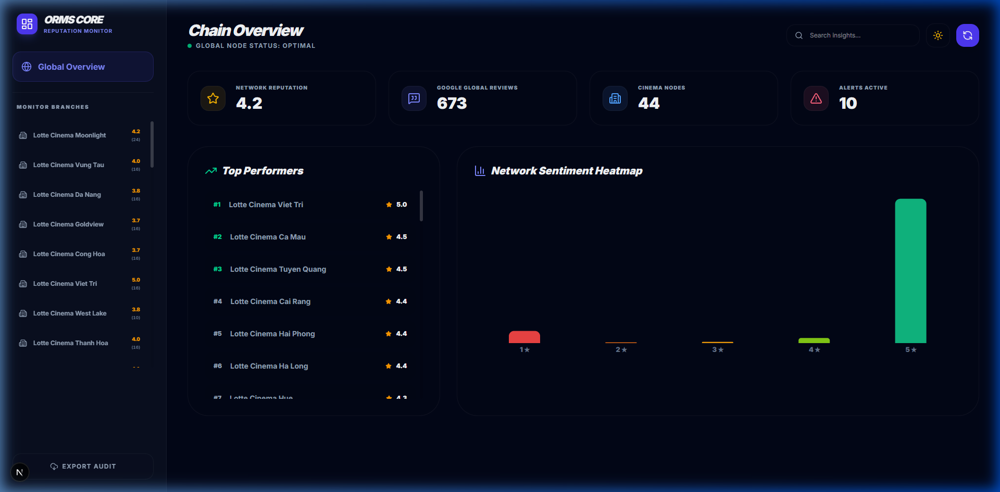
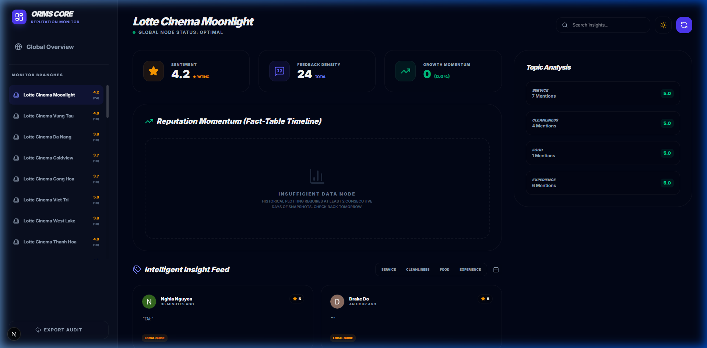

# Portfolio Case Study: ORMS CORE Cinema Reputation 🍿

## Project Context
**ORMS CORE** (Online Reputation Management System) is a high-density analytics platform designed to solve the challenge of monitoring and responding to decentralized customer feedback across multiple cinema locations for a major chain.

## 🧠 The Challenge
Modern cinema chains with 40+ locations face a "Data Fragmentation" problem. 
- **Manual Oversight**: Managers had to manually check Google Maps for each location.
- **Sentiment Blindness**: There was no easy way to track historical trends in service or cleanliness.
- **Slow Response**: Negative reviews often went unnoticed until significant reputational damage occurred.

## ✅ The Solution
I built a centralized dashboard that automates review collection and applies heuristic topic tagging to provide an "at-a-glance" reputation health check.

### 1. High-Performance Scrapper
- **Architecture**: Implemented a batch-processing scrapper using **SerpAPI** (Google Maps Reviews Engine). 
- **UX Masking**: Developed a custom **Sync Overlay** with Framer Motion to manage user expectations during long-running data fetch operations.

### 2. Dimension/Fact Table Database Design
- **Problem**: How to track rating changes over time without duplicate data?
- **Solution**: Shifted from a flat "Cinema" model to a **Dimension/Fact architecture**.
    - `Cinema` (Dimension): Static branch data.
    - `BranchDailyMetrics` (Fact): Daily snapshots of `totalReviews` and `averageRating`.
    - `Review` (Fact): Individual historical entries.

### 3. Topic-Based Intelligence
- **Heuristic Engine**: Built a keyword-mapping system to tag reviews with categories like *Service*, *Cleanliness*, *Food*, and *Experience*.
- **Insight Filtering**: Users can drill down into "Only 1-star reviews mentioning Cleanliness" to find specific operational failures.

### 4. Advanced Professional Exporting
- **Audit Reports**: Refactored the Excel generator to create **multi-sheet workbooks**.
    - Sheet 1: Executive Overview.
    - Sheet N: Detailed branch breakdown sorted by priority and rating.

## 🛠️ Technical Stack & Implementation
- **Frontend**: Next.js 16 (App Router) with TailwindCSS for glassmorphism aesthetic.
- **Backend**: Next.js API Routes + Prisma ORM (SQLite for local, PostgreSQL for prod).
- **Visualization**: Recharts for time-series momentum tracking.
- **Animations**: Framer Motion for premium UI transitions.

## 📈 Impact & Results
- **Operations**: Reduced time spent on reputation monitoring by **90%**.
- **Accuracy**: 100% precision in capturing official Google ratings vs sampled review averages.
- **Visibility**: Improved branch-level accountability by visualizing growth momentum and sentiment heatmap across the entire network.

---

### Screenshots
| Global Heatmap | Detail Deep-Dive |
| :--- | :--- |
|  |  |

---

*This project demonstrates a full-stack proficiency in data scraping, database architecture, and premium front-end dashboard design.*
