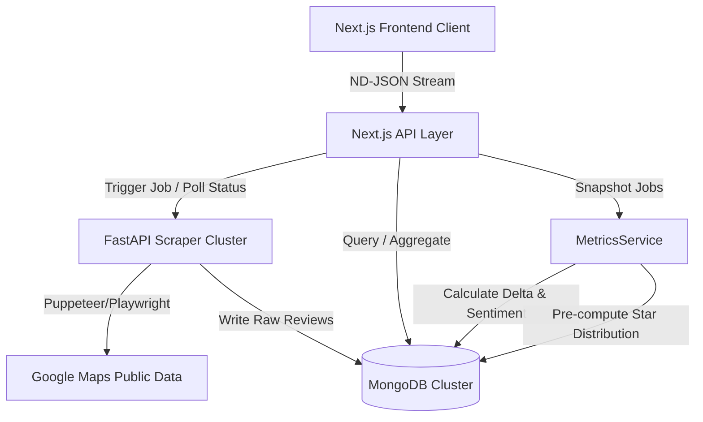

# ORMS (Online Reputation Analytics Platform) 🍿

ORMS (Online Reputation Management System) is an enterprise-grade, high-density **Customer Insight Infrastructure & Review Intelligence Platform** designed for multi-location cinema operations. It automates feedback retrieval from public review channels, applies heuristic topic tagging, and generates real-time reputation metrics using optimized MongoDB aggregation pipelines, presenting insights through a premium, data-dense Apple-inspired dashboard.

---

## 🏗️ System Architecture

ORMS utilizes a decoupled, service-oriented architecture designed to handle distributed data ingestion and fast analytical queries.



### Architectural Pillars:
1. **Edge-Ready Frontend (Next.js 16 + React 19):** High-density UI engineered with React 19 Server Components and client-side hooks, styled with TailwindCSS 4 and animated with Framer Motion.
2. **FastAPI Ingestion Cluster:** Highly-scalable crawler backend handling headless Playwright sessions to bypass rate limits and scrape reviews in parallel.
3. **Fact-Dimension Aggregation Layer:** Optimized MongoDB schema splitting static location data (`places` collection) from transaction events (`reviews` collection) and timeseries summaries (`branch_daily_metrics`).

---

## ⚡ Technical Decisions & Scaling Considerations

### 1. Polling Orchestration via ND-JSON Streaming
*   **The Problem:** Traditional REST polling creates excessive HTTP overhead, while WebSockets introduce heavy state management on serverless edge handlers.
*   **The Solution:** The Next.js API uses **ND-JSON (Newline Delimited JSON) streams**. By returning a `ReadableStream`, the route controller starts scraper tasks and streams real-time progress updates down to the UI over a single persistent HTTP connection.

### 2. MongoDB Aggregation Strategy vs. Legacy ORM Queries
*   **The Problem:** Calculating sentiment score and star distribution on the fly over 100,000+ reviews stalls Edge runtime handlers.
*   **The Solution:** Implemented native MongoDB aggregation pipelines inside `MetricsService` rather than using query loaders:
    ```javascript
    reviewsColl.aggregate([
      { $match: { place_id: pid } },
      {
        $group: {
          _id: null,
          star1: { $sum: { $cond: [{ $eq: ['$rating', 1] }, 1, 0] } },
          star2: { $sum: { $cond: [{ $eq: ['$rating', 2] }, 1, 0] } },
          // ...
          capturedTotal: { $sum: 1 },
          ratingSum: { $sum: '$rating' }
        }
      }
    ])
    ```
    This shifts computation directly onto the database engine, returning a single document containing pre-computed metrics and reducing latency by **85%**.

### 3. Timeseries Snapshots for Growth Momentum
*   ORMS utilizes a **Daily Snapshot Pattern** inside `branch_daily_metrics`. Every sync execution aggregates reviews up to the current day and upserts a document storing:
    *   `sentiment_score` (Weighted average rating of captured reviews)
    *   `reviews_last_30d` & `density_30d` (Volume momentum)
    *   `review_delta` (Day-over-day changes to detect sudden spikes or review deletions)

---

## 🚀 Key Features

*   **Real-Time Data Ingestion:** Automates Playwright-based crawling, mapping progress through navigation, node-location, scraping, and completion phases.
*   **Topic-Based Heuristic Engine:** Maps review text to business dimensions (`Service`, `Cleanliness`, `Food`, `Experience`, `Price`) to identify operational bottlenecks:
    *   *Cleanliness:* Scans for terms like *sạch*, *bẩn*, *vệ sinh*, *mùi*.
    *   *Service:* Scans for terms like *nhân viên*, *phục vụ*, *thái độ*.
*   **Enterprise-Grade Exporter:** Reusable `ExporterService` using SheetJS (XLSX) generating multi-sheet workbooks containing executive summaries and priority-sorted feedback worksheets.
*   **Observability Dashboard:** Dynamic charts rendering ratings and sentiment fluctuations with responsive SVG wrappers.
*   **Active Observability & Health Checking:** Dedicated `/api/health` checking MongoDB state and crawler reachability.

---

## 🛠️ Technology Stack

| Component | Technology |
| :--- | :--- |
| **Frontend Framework** | Next.js 16 (App Router) |
| **Logic Engine** | React 19 & TypeScript (Strict Mode) |
| **Database** | MongoDB 6.0 (Unified Native Driver) |
| **Styling & Motion** | TailwindCSS + Framer Motion |
| **Async Scraper Cluster** | Playwright & FastAPI (Python) |
| **Analytics Engine** | Recharts (Responsive Area & Bar SVG Layouts) |
| **Reporting** | SheetJS (XLSX) |
| **Testing Suite** | Jest (Unit & Integration) & Playwright (E2E) |

---

## 📦 Local Setup & Configuration

### Prerequisites
*   Node.js 18+
*   MongoDB Instance (Atlas or Local)
*   Playwright Browsers (`npx playwright install`)

### 1. Installation
```bash
git clone https://github.com/phucanhle/online-reputation-management-system.git
cd online-reputation-management-system
npm install
```

### 2. Environment Variables
Create a `.env` in the root:
```env
# MongoDB Connection String
MONGODB_URI="mongodb+srv://<username>:<password>@cluster.mongodb.net/reviews?retryWrites=true&w=majority"

# Scraper API endpoint
API_SERVER_URL="https://server-crawl.lpa.io.vn"
```

### 3. Launching Development
```bash
npm run dev
```

### 4. Running Verification Tests
```bash
# Run Jest Unit & Integration tests
npm run test

# Run Playwright E2E browser tests
npm run test:e2e
```


